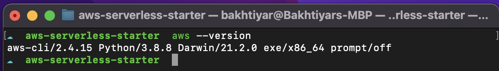
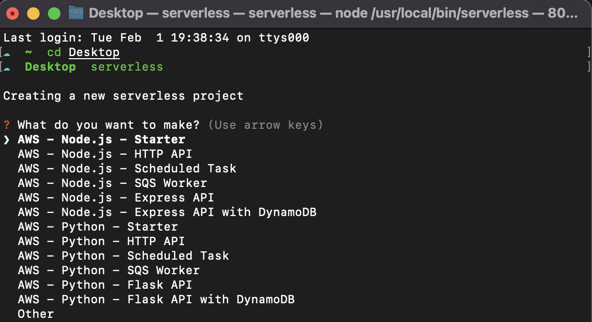
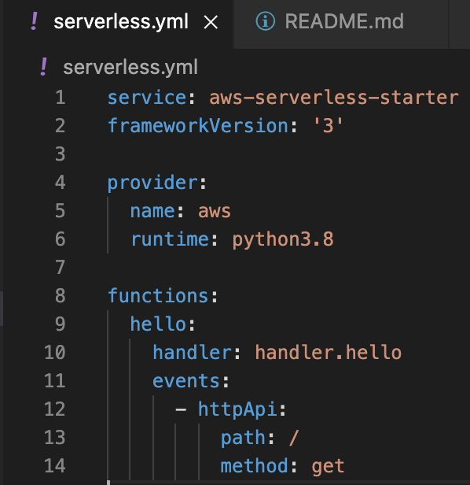
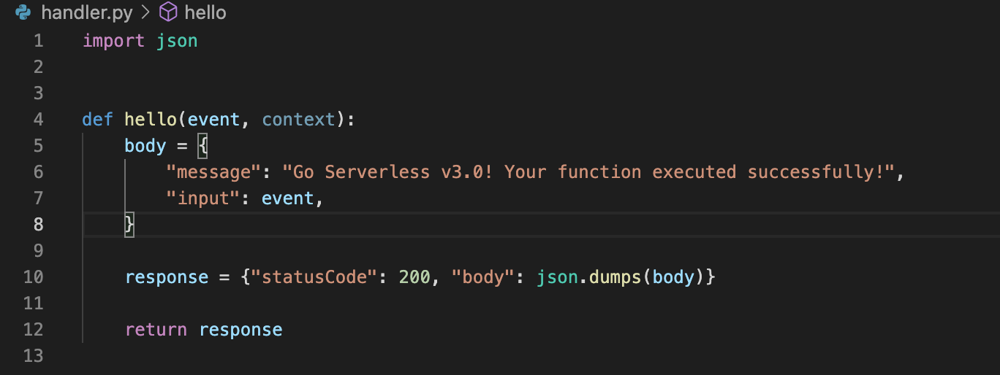
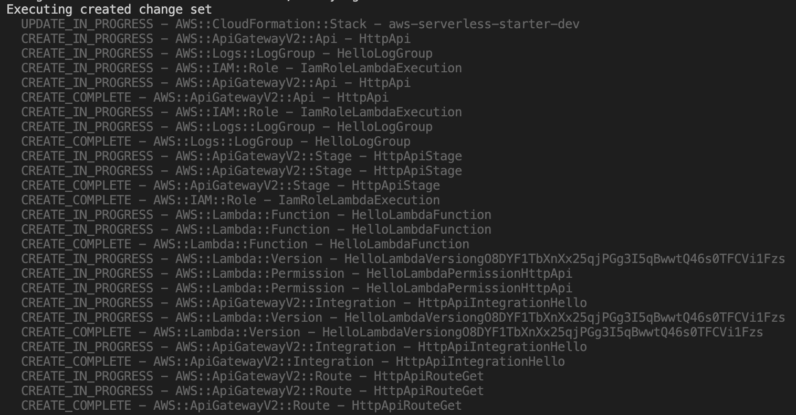
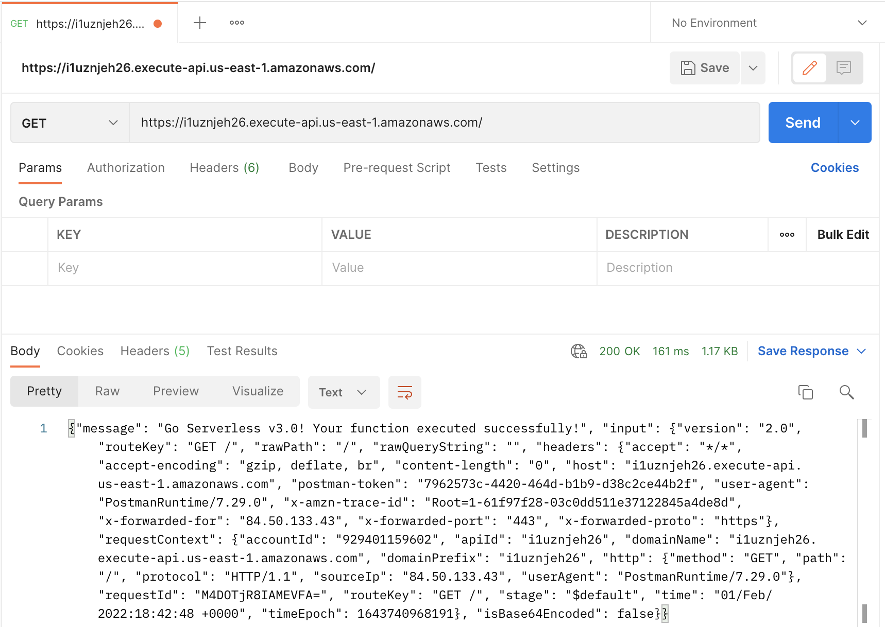
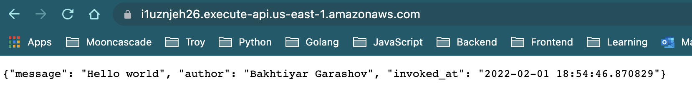
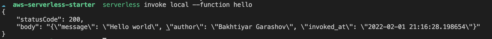

## Serverless app via AWS Lambda, ApiGateway and Serverless framework

## Configuration of AWS CLI and IAM user credentials
Hi there. Within this tutorial we'll try to write a simple serverless application using AWS Lambda functions, ApiGateway for triggering the functions and Serverless framework for IaC. Before starting it is worth to note that you will need to have an AWS account for this tutorial. Also, you need to install AWS CLI for working with the AWS environment from your console. 


First thing to do is creating a new AWS IAM user. This will make is possible for Programmatic access to the resources in your cloud environment. Creating an IAM user is out of the scope of this tutorial but you can refer to [this](https://docs.aws.amazon.com/IAM/latest/UserGuide/id_users_create.html) official guide for this. It is important not to forget to download your newly created IAM user credentials which are the Access and Secret keys. 

**Neither share them with 3rd party nor push to any remote repository.**

After getting the credentials let's configure our local machine for interacting with the AWS environment easily. Firstly we need to install AWS CLI tool. Note that the steps below is a guide for installing CLI tool for MacOS X. For other platforms, check the [official doc](https://docs.aws.amazon.com/cli/latest/userguide/getting-started-install.html) for installation.

1. Firstly, install the remote package to your system via

```bash
curl "https://awscli.amazonaws.com/AWSCLIV2.pkg" -o "AWSCLIV2.pkg"
```

2. Then, install the downloaded package via

```bash
sudo installer -pkg ./AWSCLIV2.pkg -target /
```

After installation you can verify that by using the `aws --version` command. Output should be like below



And the final step of configuration is creating new AWS profile for that. AWS profile or more specifically named profile is an easy way of managing credentials for AWS Command Line Interface.

>A named profile is a collection of settings and credentials that you can apply to a AWS CLI command. When you specify a profile to run a command, the settings and credentials are used to run that command. Multiple named profiles can be stored in the config and credentials files.

> by <cite>[AWS](https://docs.aws.amazon.com/cli/latest/userguide/cli-configure-profiles.html)</cite>

For creating a new profile locally use the command below.

```bash
aws configure --profile <profile_name>
```
It will prompt AWS Access and Secret keys and will save them as a named profile in `~/.aws/credentials` file. Here you need to use previously downloaded AWS IAM credentials when creating the user in the previous section

## Creating a new serverless application via Serverless framework

Before starting with the very basic application which will be deployed to AWS Lambda functions we need to talk about what Serverless framework is and how to install and use it. Let's look at what others say about it.

>Serverless Framework is an open source tool available for building, packaging and deploying serverless applications across multiple cloud providers and platforms like AWS, GCP, Azure, Kubernetes, etc.

> from <cite>[Anuj Kumar](https://medium.com/kodeyoga/serverless-framework-a73f63ab603b)<cite>

By using simple configuration template Serverless framework makes is extremely easy to create resources on AWS environment and deploy your code there. Enough talking, let's download and create the very first serverless application!

As the Serverless framework is written is JavaScript, you need to have Node.js runtime environment installed. You can check the official website for installing Node.js. It is always safe to use LTS which stands for Long term support version. After installing Node, use the command below to install the Serverless framework

```bash
npm install -g serverless
```

As we are using the `-g` flag here it means we are installing the package globally. In this case it throws permission error. No worries, simply use the sudo'ed version of the command and insert your root user password. It should be successful this time.

```bash
sudo npm install -g serverless
```
Great!

Next step is creating the very basic project skeleton for our serverless application. Creating an app from scratch is extremely easy. Simply run the command below and use arrow keys to navigate between options.

```bash
serverless
```

Choose the basic Python HTTP option, press enter. 



It is important to note that Serverless framework is not limited with these options. You can choose many other programming languages and environments. Python and Node.js are simply well-known and mostly used ones.


Next it will ask a name for the project (or simply press enter and proceed with the default name). And the last question asks to which organization this app belongs to. We don't need to specify anything here, so simply choose the skip option and press enter. That's it. Our Python application should be created in the corresponding directory. Now let's look at the files of the app and explore the serverless.yml file which is template file for deployment.

In the directory we'll see 4 files: .gitignore, handler.py, README.md and serverless.yml. As you would imagine most important ones are handler.py and serverless.yml files there.

Firstly, let's explore serverless.yml file. It is simple a template file which will be converted to AWS Cloudformation and used as IaC definition for creating the resourced during the deployment. Please, use Google for getting more info on AWS CloudFormation :)

Let's go top to bottom and explain each line here:





The first 2 lines are generic ones and give information about the created service name and serverless framework version respectively. 

The next block defines the generic properties of the Cloud vendor. In this case it is AWS (could be GCP or Azure too). The property `runtime` indicates which Python version will be used in our serverless stack. Although AWS lambda function fully supports Python version 3.9, default version of Python in Serverless framework is 3.8. We can simply use 3.9 instead without any issue.

And the last block defines the functions. It can be seen that as we have newly created project, we have only a function named `hello`. Path defines the path in which our corresponding function will receive an event and be invoked. And method shows the HTTP method which is expected by our API Gateway.

Next, let's explore the very first Python file which will be invoked after deploy to the AWS environment.



We can see that is it very basic Python function which receives 2 parameter and returns a response. One of the received parameter is called event and will play the role of request object if you are familiar with web development. But, I'll not dive into them and they are out of context here.


Let's deploy this function and invoke it via publicly available URL provided by AWS using AWS API Gateway. Deploying the application via Serverless framework is as easy as running a command with multiple optional parameters

```bash
serverless deploy --verbose --config serverless.yaml --aws-profile <your_aws_profile>
```

Here we see some parameters and they needs to be explained. First parameter is the `--verbose or -v` flag which tells Serverless framework CLI to show us the each process as a step clearly. `--config` is used to tell which config file or template should be used as input. It is worth to mention that if you have only one template file (like we have currently :)), using this parameter would not make sense and could be ignored. But if you have complex setup and multiple environments such as serverless.stage.yml, serverless.prod.yml and serverless.dev.yml, using `--config` and specifiying the input file explicitly makes absolute sense. 

And the last parameter is `--aws-profile` which specifys the locally created AWS CLI user and Serverless framework in this case will grab and use those saved credentials from your local .aws directory. It removes the hassle of dealing with multiple IAM user credentials. 

Finally, let's input the command and press enter.

As we are using the verbose parameter, we can see the detail of each step during the deployment. It is worth to note here that although we have defined only Lambda functions in the IaC template, AWS will create many other resources and update some automatically which are important such as AWS ApiGateway, Aws Logs etc.

Example output from deployment:



After the initial deployment steps, a newly directory with the name `.serverless` will be created where your application files reside. As we have mentioned earlier Serverless framework uses AWS Cloudformation behind the scene to create resources. And the template files for Cloudformation will be saved under this directory.

Let's open Postman to invoke our function. You can use any client to for that, even browser. But I prefer Postman here. And the result of our deployed Python function is




Let's change the response to something simpler, re-deplpoy and invoke function again.

Copy the code below and put it in handler.py file. 

```py
import json
from datetime import datetime

def hello(event, context):
    body = {
        "message": "Hello world",
        "author": "Bakhtiyar Garashov",
        "invoked_at": str(datetime.now())
    }

    response = {"statusCode": 200, "body": json.dumps(body)}

    return response
```
Let's copy the url and use browser this time for triggering the function




And as a final step, if you don't want to get a huge bill after some time (:D), run the command below to destroy all the created resourced

```bash
serverless remove --verbose --config serverless.yml --aws-profile <profile>
```

If you are having issue with using AWS it is always possible to invoke the Serverless functions locally. For example,

```bash
serverless invoke local --function hello 
```

Here we are saying to the Serverless framework that invoke the function with the name 'hello' locally. And:




That's it. Next time we'll see how to write serverless CRUD application which uses AWS DynamoDb (NoSQL database managed by AWS) as the storage. 

Stay tuned...
